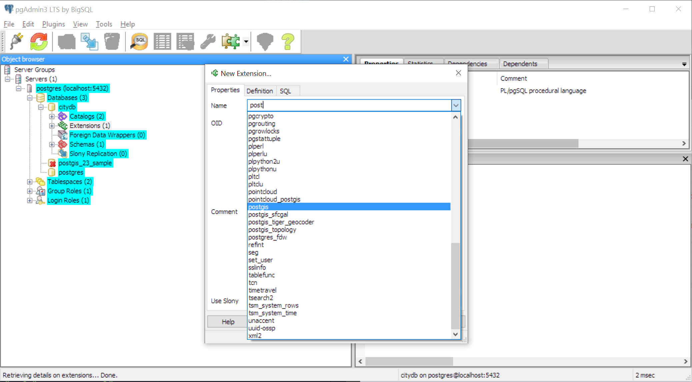

# Creating 3D Map with your own 3D tile server


## Summary
Our goal is to visualize 3D spatial data specifically available in CityGML format.

**Using existing 3D-tileset (NYC only)**
- Existing 3D-Tiles are available [here](https://cesiumjs.org/NewYork/3DTiles/NewYork.zip)
- We'll use 3DCityDB-Web-Map-Client to render the tiles in Cesium

**Creating your own tileset**
- The available [NYC 3-D building model](http://www1.nyc.gov/site/doitt/initiatives/3d-building.page) data is available in `CityGML files`.
- We'll convert that to 3D tiles compatible with Cesium JS.
- Intermediate require utilization of `3dCityDb Importer-Exporter` to import CityGML files into PostGreSQL database. Then export the data into 3D tiles Collada/gltf format.
- On client side the tiles will be rendered with CesiumJS.

## Datasets
- Sample CITYGML Dataset : [NYC_Flatiron_Buildings_Streets_Lots_20150907.zip](http://www.3dcitydb.net/3dcitydb/fileadmin/mydata/Cesium_NYC_Demo/CityGML/NYC_Flatiron_Buildings_Streets_Lots_20150907.zip)
- [NYC 3-D CITYGML](http://maps.nyc.gov/download/3dmodel/DA_WISE_GML.zip)
- [NYC OSM Data 3D-tileset](https://cesiumjs.org/NewYork/3DTiles/NewYork.zip)


## Setup
*Note: The setup was conducted on Windows 10. Steps may vary for MacOS/Linux*

## Using existing 3D-tileset (NYC only)
The data NYC 3D tiles is already created [here](https://cesiumjs.org/NewYork/3DTiles/NewYork.zip)
Reference: [Issue #91 OSM Model of New York](https://github.com/AnalyticalGraphicsInc/3d-tiles/issues/91)


We'll use 3dCityDb web map to render the tileset. As stated in [Issue #1](https://github.com/3dcitydb/3dcitydb-web-map/issues/1), we'll use `b3dmlayer.js` from [older commit](https://raw.githubusercontent.com/3dcitydb/3dcitydb-web-map/c47d108aefedffac628e60d157afb79f45a9ec0b/js/b3dmlayer.js).

- Current repo : [https://github.com/3dcitydb/3dcitydb-web-map](https://github.com/3dcitydb/3dcitydb-web-map)
- Old repo : [https://github.com/3dcitydb/3dcitydb-web-map/tree/c47d108aefedffac628e60d157afb79f45a9ec0b](https://github.com/3dcitydb/3dcitydb-web-map/tree/c47d108aefedffac628e60d157afb79f45a9ec0b)
- Forked Repo: [https://github.com/UrbanEcologyLab/3dcitydb-web-map](https://github.com/UrbanEcologyLab/3dcitydb-web-map)

### Steps
- Clone `https://github.com/UrbanEcologyLab/3dcitydb-web-map` and follow the steps [here](https://github.com/UrbanEcologyLab/3dcitydb-web-map#instructions)

**OR**

- `git clone https://github.com/3dcitydb/3dcitydb-web-map`
- Download [b3dmlayer.js](https://raw.githubusercontent.com/3dcitydb/3dcitydb-web-map/c47d108aefedffac628e60d157afb79f45a9ec0b/js/b3dmlayer.js)
- Move it to `3dcitydb-web-map/js`
- Download [NYC OSM 3D Tiles](https://cesiumjs.org/NewYork/3DTiles/NewYork.zip)
- Unzip the contents in `examples/b3dmNY`
- rename `tileset.json -> tiles.json`
- create `index.html` to display the tiles. [Link](https://raw.githubusercontent.com/UrbanEcologyLab/3dcitydb-web-map/master/examples/b3dmNY/index.html)
- Update `server.js` to serve `content-encoding: gzip` for `examples/b3dmNY` static files.
- Run `node server.js` and point your browser to `http://localhost:8000/examples/b3dmNY`

### Known Issues
The buildings do not load for b3dmNY example

## Creating your own 3D-tileset

### Requirements
- [PostGreSQL database](https://www.bigsql.org/postgresql/installers.jsp) & [PostGIS Server](http://postgis.net/install/)
- 3dCityDb Importer-Exporter : [Download](http://www.3dcitydb.net/3dcitydb/d3dimpexp/)
- Java 8 or higher

### Steps
- Download the sample data set : [NYC_Flatiron_Buildings_Streets_Lots_20150907](http://www.3dcitydb.net/3dcitydb/fileadmin/mydata/Cesium_NYC_Demo/CityGML/NYC_Flatiron_Buildings_Streets_Lots_20150907.zip)
- Install PostgreSQL (9.6.1) from [bigsql](https://www.bigsql.org/postgresql/installers.jsp). You'll have to provide a username and password for the database.
- Launch BigSQL and install the extension `postgis23-pg96-2.3.0-1`
  - *If extension is not visible: Copy files from `C:\Program Files\PostgreSQL\pg96\share\extension` to `C:\Program Files\PostgreSQL\pg96\share\postgresql\extension`*
- Check for latest updates

  

- Download PostGis Bundle from [here](http://postgis.net/install/). Windows Version [here](http://download.osgeo.org/postgis/windows/pg96/)
- Install PostGis Bundle in the PostgreSQL folder `C:\Program Files\PostgreSQL\pg96`
- Open `pgAdmin III` application. Connect to your PostGreSQL Database.
- Create an empty database `citydb`.

  

- Enter the database and install the `postgis` extension

  

- Install 3DCityDB-Importer-Exporter from this [download section](http://www.3dcitydb.net/3dcitydb/d3dimpexp/). version 3.3.1 [download](http://www.3dcitydb.net/3dcitydb/fileadmin/downloaddata/3DCityDB-Importer-Exporter-3.3.1-Setup.jar)
- Go to the location where 3dCityDb Scripts have been installed : `C:\Program Files\3DCityDB-Importer-Exporter\3dcitydb\postgresql`.
- Run the following command:

  ```
  psql -h your_host_address -p 5432 -d your_database -U your_username -f CREATE_DB.sql

  # Example
  psql -h localhost -p 5432 -d "citydb" -U "postgres" -f "CREATE_DB.sql"

  ```
- You will be asked to provide SRID (Spatial Reference Identifier). You can look up SRID [here](http://www.spatialreference.org)
- For our puposes we will enter `SRID:3627` for New York Long Island and `SRS: urn:ogc:def:crs:EPSG::3627`

  

- Upon completion the following message should appear

  

- Open 3DCityDB-Importer-Exporter. Go to `database` tab and connect to your PostGreSQL Database.

  

- Go to `import` tab and import the CityGML file.

  

- Before exporting we need to find the bounding box. Go back to `database` tab and hit `calculate`. Copy the bounding-box attributes.

  

- Go to `KML/COLLADA/glTF Export` tab and paste the copied bounding-box coordinates here. Make sure the `Reference system` is the same as copied.

- Hit Export. The sample data took 33 minutes to export.

  

- Following steps include conversion of `.dae to .gltf` and then `.gltf to .b3dm`. However, the gtlf to b3dm convertor is [not available as open source](https://github.com/3dcitydb/importer-exporter/issues/13)

- Conversion of .dae to .gltf: Take a look at KhronosGroup's [COLLADA2GLTF](https://github.com/KhronosGroup/COLLADA2GLTF)
On windows 10, the tool can be used via [Ubuntu bash for Windows 10](http://www.howtogeek.com/249966/how-to-install-and-use-the-linux-bash-shell-on-windows-10/)

- After obtaining .gltf files. Refer to [gltf-b3dm-convertor](https://github.com/daniel-hilton/gltf-b3dm-convertor) by Daniel Hilton.

## Commercial option
[VirtualCitySystems](http://www.virtualcitysystems.de/) provide commercial services for creating .b3dm tiles.

## Reference
1. [3D web visualization of huge CityGML models](http://www.int-arch-photogramm-remote-sens-spatial-inf-sci.net/XL-3-W3/601/2015/isprsarchives-XL-3-W3-601-2015.pdf)
2. [3dCityDb from Technische Universität München](http://www.3dcitydb.net/3dcitydb/downloads/)
3. 3dCityDb [Documentation](https://github.com/3dcitydb/3dcitydb/blob/master/Documentation/3DCityDB_Documentation_v3.3.pdf)
4. 3dCityDb PostGIS [Tutorial](http://www.3dcitydb.org/3dcitydb/fileadmin/downloaddata/3dcitydb-v2_0_6-postgis-tutorial.pdf)
5. [Getting Started](http://www.bostongis.com/PrinterFriendly.aspx?content_name=postgis_tut01) with PostGIS
6. Sample CityGML data provided by [Technische Universität München](https://www.gis.bgu.tum.de/projekte/new-york-city-3d/).
